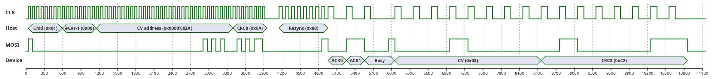

# ZUSI

[](https://github.com/ZIMO-Elektronik/ZUSI/actions/workflows/build.yml) [](https://github.com/ZIMO-Elektronik/ZUSI/actions/workflows/tests.yml) [](https://github.com/ZIMO-Elektronik/ZUSI/raw/master/LICENSE)


ZUSI is a ZIMO specific protocol for the [SUSI](https://normen.railcommunity.de/RCN-600.pdf) bus. It supports [ZPP](https://github.com/ZIMO-Elektronik/ZPP) updates on multiple decoders in parallel with up to 1.8MBaud. In addition, it also supports fast reading and writing of CVs for individual decoders. The protocol is currently supported by the following products:
- Command stations
  - [ZIMO MXULF](https://www.zimo.at/web2010/products/InfMXULF_EN.htm)
- Decoders
  - [ZIMO MN decoders](http://www.zimo.at/web2010/products/mn-nicht-sound-decoder_EN.htm)
  - [ZIMO small-](http://www.zimo.at/web2010/products/ms-sound-decoder_EN.htm) and [large-scale MS decoders](http://www.zimo.at/web2010/products/ms-sound-decoder-grossbahn_EN.htm)
  - [ZIMO small-](http://www.zimo.at/web2010/products/lokdecoder_EN.htm) and [large-scale MX decoders](http://www.zimo.at/web2010/products/lokdecodergrosse_EN.htm)

<details>
  <summary>Table of Contents</summary>
  <ol>
    <li><a href="#protocol">Protocol</a></li>
      <ul>
        <li><a href="#electrical-specification">Electrical Specification</a></li>
        <li><a href="#entry">Entry</a></li>
        <li><a href="#transmission">Transmission</a></li>
        <li><a href="#commands">Commands</a></li>
      </ul>
    <li><a href="#getting-started">Getting Started</a></li>
      <ul>
        <li><a href="#prerequisites">Prerequisites</a></li>
        <li><a href="#installation">Installation</a></li>
        <li><a href="#build">Build</a></li>
      </ul>
    <li><a href="#usage">Usage</a></li>
  </ol>
</details>

## Protocol
### Electrical Specification
Regarding the electrical properties, ZUSI adheres to the specifications of [RCN-600](https://normen.railcommunity.de/RCN-600.pdf), so reference is made to the standard at this point. The data transfer itself uses a combination of [SPI](https://en.wikipedia.org/wiki/Serial_Peripheral_Interface) and GPIO single bit toggles. The SPI interface must be able to use **mode 1 (CPOL 0, CPHA 1)** which means that data is clocked out on a rising clock edge and read on a falling clock edge. Bidirectional SPI (MOSI only) functionality is advantageous but not mandatory. All transmissions take place **LSB first**. The transmission speed is specified by the host; a [feature request](#features) makes it possible to query the maximum speed of all participants on the bus.

Four different clock frequencies are available.

| Clock Period [µs] | Bit Rate [Mbps] | Description                                         |
| ----------------- | --------------- | --------------------------------------------------- |
| 10                | 0.1             | Resync timing                                       |
| 3.5               | 0.286           | Fallback timing, slowest used for data transmission |
| 0.733             | 1.364           | 2. fastest possible                                 |
| 0.5533            | 1.807           | Fastest possible                                    |

These timings do not need to be matched precisely, it is acceptable to achieve a slightly slower data-rate.

### Entry
To connect devices (decoders) to the host, the host needs to send **0x55** (or **0xAA**) for at least a second with a clock period fixed at 10ms. This is necessary to allow the decoder to evaluate the signal during its normal operation. 

#### Alternative Entry
:construction:

### Transmission
The transmission is generally divided into 5 phases:
- [Command phase](#command-phase)
- [Resynchronization Phase](#resynchronization-phase)
- [ACK Phase](#ack-phase)
- [Busy Phase](#busy-phase)
- [Response Phase](#response-phase)

The following graphic shows the transmission of a [CV Read](#cv-read) packet including response. After the command has been transmitted, including some data, a resync byte is sent. The direction of the data is then reversed and all connected devices have the opportunity to respond. This response consists of an ACK and Busy phase and, if provided for by the command, the transmission of the requested data.


#### Command phase
During the command phase the host transmits a [command](#commands) including any data at the currently set transmission speed.

#### Resynchronization Phase
To avoid problems with the MX644, a resynchronization phase has been introduced between host transmission and device response. This phase consists of a delay of at least 10µs, followed by a transmission of the byte **0x80**. The clock period for the transmission is 10µs, which corresponds to a an SPI frequency of 0.1Mbps.

To catch asynchronous behavior, the state-machine of a decoder will be reset after 10ms of no activity on the clock. This can be used to resync all decoders.

#### ACK Phase
After the last bit of the host transmission (after the resynchronization phase), the host switches the data line to input. The decoder will send a two bit answer, one called **ACK valid** and one **ACK** (in this order). 

**ACK valid** should always be low. This verifies that **at least one** decoder is still connected and received the command. If **ACK valid** is high, then the host must assume that no decoder has received the command. (wired OR).

**ACK** is high if all decoders have confirmed the command. If **ACK** is low (**NAK**), at least one decoder has not acknowledged the command (wired AND).

Again, there is a special workaround for the MX644. The ACK phase uses an asymmetric clock period of 10µs high to 20µs low. Both ACK valid and ACK/NAK will be set by the decoder on a rising edge on clock and can be read on the falling edge.

#### Busy Phase
Some commands (e.g. [ZPP Erase](#zpp-erase) or [ZPP Write](#zpp-write)) contain a busy phase. Similar to the ACK bits, a bit is clocked by the host. The decoder waits for the clock line to be high and then pulls the data line low. While the data line is low, the decoder can execute the received command. When it is finished, it waits for the clock line to be low and then releases the data line again. This results in a wired AND, the data line will only be high if all decoders are finished. The host clock is suspended during the busy phase.

#### Response Phase
During the response phase the device transmits data at the currently set transmission speed.

### Commands
ZUSI uses a command specific frame structure. The first byte of each frame marks the used command, all subsequent bytes will be sent according to frame description. 

#### CV-Read
| Length | Name       | Value / Limits | Description                                    |
| ------ | ---------- | -------------- | ---------------------------------------------- |
| 1 byte | Command    | 0x01           | Command code                                   |
| 1 byte | Count - 1  | 0 - 255 (=N-1) | Number of CVs to read                          |
| 4 byte | CV address | 0 - 1023       | Address of the first CV                        |
| 1 byte | CRC        |                | CRC8 checksum                                  |
| 1 byte | Resync     | 0x80           | Resync byte                                    |
|        |            |                |                                                |
| 1 bit  | ACK valid  |                |                                                |
| 1 bit  | ACK        |                |                                                |
| x bits | Busy       |                |                                                |
| N byte | CV values  |                | Values of the read CVs                         |
| 1 byte | CRC        |                | CRC8 checksum                                  |

CV Read is used to read CV values ​​from a decoder.

> [!WARNING]  
> Current implementations only read one byte at a time.

#### CV-Write
| Length | Name       | Value / Limits | Description             |
| ------ |  --------- | -------------- | ----------------------- |
| 1 byte | Command    | 0x02           | Command code            |
| 1 byte | Count - 1  | 0 - 255        | Number of CVs to write  |
| 4 byte | CV address | 0 - 1023       | Address of the first CV |
| N byte | Values (N) |                | CV values to be written |
| 1 byte | CRC        |                | CRC8 checksum           |
| 1 byte | Resync     | 0x80           | Resync byte             |
|        |            |                |                         |
| 1 bit  | ACK valid  |                |                         |
| 1 bit  | ACK        |                |                         |
| x bits | Busy       |                |                         |

CV Write is used to write CV values ​​into a decoder.

> [!WARNING]  
> Current implementations only write one byte at a time.

#### ZPP-Erase
| Length | Name          | Value / Limits | Description                  |
| ------ | ------------  | -------------- | ---------------------------- |
| 1 byte | Command       | 0x04           | Command code                 |
| 1 byte | Security byte | 0x55           |                              |
| 1 byte | Security byte | 0xAA           |                              |
| 1 byte | CRC           |                | CRC8 checksum                |
| 1 byte | Resync        | 0x80           | Resync byte                  |
|        |               |                |                              |
| 1 bit  | ACK valid     |                |                              |
| 1 bit  | ACK           |                |                              |
| x bits | Busy          |                |                              

The ZPP Erase command can be used to erase the flash in the decoder.

> [!WARNING]  
> Deleting a NOR flash can take up to 200s depending on the manufacturer and type.

#### ZPP-Write
| Length | Name           | Value / Limits | Description                                                  |
|  ----  |  ------------  | -------------- | ------------------------------------------------------------ |
| 1 byte | Command        | 0x05           | Command code                                                 |
| 1 byte | Size           |                | Size of the data block to write into the decoder flash       |
| 4 byte | Address        |                | Absolute flash address of the first byte of sent flash block |
| x byte | Data           | up to 256 byte | Block data to be written to decoder flash                    |
| 1 byte | CRC            |                | CRC8 checksum                                                |
| 1 byte | Resync         | 0x80           | Resync byte                                                  |
|        |                |                |                                                              |
| 1 bit  | ACK valid      |                |                                                              |
| 1 bit  | ACK            |                |                                                              |
| x bits | Busy           |                |                                                              |

ZPP Write is used to transfer ZPP data.

> [!WARNING]  
> Current implementations only support a payload of **exactly** 256 bytes.

#### Features
<table>
  <thead>
    <tr>
      <th style="text-align: center">Length</th>
      <th style="text-align: center">Name</th>
      <th style="text-align: center">Value / Limits</th>
      <th style="text-align: center">Description</th>
    </tr>
  </thead>
  <tbody>
    <tr>
      <td>1 byte</td>
      <td>Command</td>
      <td>0x06</td>
      <td>Command code</td>
    </tr>
    <tr>
      <td>1 byte</td>
      <td>CRC</td>
      <td></td>
      <td>CRC8 checksum</td>
    </tr>
    <tr>
      <td>1 byte</td>
      <td>Resync</td>
      <td>0x80</td>
      <td>Resync byte</td>
    </tr>
    <tr>
      <td></td>
      <td></td>
      <td></td>
      <td></td>
    </tr>
    <tr>
      <td>1 bit</td>
      <td>ACK valid</td>
      <td></td>
      <td></td>
    </tr>
    <tr>
      <td>1 bit</td>
      <td>ACK</td>
      <td></td>
      <td></td>
    </tr>
    <tr>
      <td>x bits</td>
      <td>Busy</td>
      <td></td>
      <td></td>
    </tr>
    <tr>
      <td>1 byte</td>
      <td>Baud rate flags</td>
      <td></td>
      <td>
        Bit7:3=1 (always)<br>
        Bit2=0 0.5533µs timing supported<br>
        Bit1=0 0.733µs timing supported<br>
        Bit0=0 3.5µs timing supported<br>
      </td>
    </tr>
    <tr>
      <td>1 byte</td>
      <td>N/A</td>
      <td>0xFF</td>
      <td></td>
    </tr>
    <tr>
      <td>1 byte</td>
      <td>N/A</td>
      <td>0xFF</td>
      <td></td>
    </tr>
    <tr>
      <td>1 byte</td>
      <td>Device flags</td>
      <td></td>
      <td>
        Bit7=0 not compatible with other devices at the same time<br>
        Bit6:0=1 (always)<br>
      </td>
    </tr>
  </tbody>
</table>

Features requests the transmission capabilities of connected devices. Feature bits (see baud rate and devices) will be pulled to 0 when at least one decoder does not support the corresponding feature.

> [!WARNING]  
> Personal note: I think someone mixed up the baud rate flags 0 and 1. As defined, now the fastest decoder determines the transmission speed, not the slowest. In addition, the CRC is missing in the response of this packet... :cry:

#### Exit
<table>
  <thead>
    <tr>
      <th style="text-align: center">Length</th>
      <th style="text-align: center">Name</th>
      <th style="text-align: center">Value / Limits</th>
      <th style="text-align: center">Description</th>
    </tr>
  </thead>
  <tbody>
    <tr>
      <td>1 byte</td>
      <td>Command</td>
      <td>0x07</td>
      <td>Command code</td>
    </tr>
    <tr>
      <td>1 byte</td>
      <td>Security byte</td>
      <td>0x55</td>
      <td></td>
    </tr>
    <tr>
      <td>1 byte</td>
      <td>Security byte</td>
      <td>0xAA</td>
      <td></td>
    </tr>
    <tr>
      <td>1 byte</td>
      <td>Option</td>
      <td></td>
      <td>
        Bit7:2=1 (always)<br>
        Bit1=0 perform CV8 reset<br>
        Bit0=0 reboot<br>
      </td>
    </tr>
    <tr>
      <td>1 byte</td>
      <td>CRC</td>
      <td></td>
      <td>CRC8 checksum</td>
    </tr>
    <tr>
      <td>1 byte</td>
      <td>Resync</td>
      <td>0x80</td>
      <td>Resync byte</td>
    </tr>
    <tr>
      <td></td>
      <td></td>
      <td></td>
      <td></td>
    </tr>
    <tr>
      <td>1 bit</td>
      <td>ACK valid</td>
      <td></td>
      <td></td>
    </tr>
    <tr>
      <td>1 bit</td>
      <td>ACK</td>
      <td></td>
      <td></td>
    </tr>
    <tr>
      <td>x bits</td>
      <td>Busy</td>
      <td></td>
      <td></td>
    </tr>
  </tbody>
</table>

This will exit the ZUSI and resume normal operation.

#### ZPP-LC-DC-Query
| Length | Name            | Value / Limits | Description                                                                                |
| ------ | --------------- | -------------- | ------------------------------------------------------------------------------------------ |
| 1 byte | Command         | 0x0D           | Command code                                                                               |
| 4 byte | Developer code  |                | Developer code (see [ZPP](https://github.com/ZIMO-Elektronik/ZPP)) file format description |
| 1 byte | CRC             |                | CRC8 checksum                                                                              |
| 1 byte | Resync          | 0x80           | Resync byte                                                                                |
|        |                 |                |                                                                                            |
| 1 bit  | ACK valid       |                |                                                                                            |
| 1 bit  | ACK             |                |                                                                                            |
| x bits | Busy            |                |                                                                                            |
| 1 byte | Load code valid |                | 0x00 Load code invalid<br>0x01 Load code valid                                             |
| 1 byte | CRC             |                | CRC8 checksum                                                                              |

A ZPP-LC-DC query can be used to check whether the decoders contain a valid load code before deleting the flash.

### Typical processes
#### ZPP Update
1. [Entry](#entry) sequence to put devices into ZUSI
2. [Features](#features) to determine transmission speed
3. [ZPP-LC-DC-Query](#zpp-lc-dc-query) (optional) to check for valid load code
   - [Exit](#exit) on negative answer
4. [ZPP-Erase](#zpp-erase)
5. [ZPP-Write](#zpp-write)
7. [Exit](#exit)
8. Leave voltage switched on for at least 1s

## Getting Started
### Prerequisites
- C++23 compatible compiler
- [CMake](https://cmake.org/) ( >= 3.25 )

### Installation
This library is meant to be consumed with CMake.

```cmake
# Either by including it with CPM
cpmaddpackage("gh:ZIMO-Elektronik/ZUSI@0.9.0")

# or the FetchContent module
FetchContent_Declare(
  ZUSI
  GIT_REPOSITORY "https://github.com/ZIMO-Elektronik/ZUSI"
  GIT_TAG v0.9.0)

target_link_libraries(YourTarget PRIVATE ZUSI::ZUSI)
```

### Build
If the build is running as a top-level CMake project then tests and a small example will be generated.
```sh
cmake -Bbuild
cmake --build build --target ZUSIZppLoad
```

## Usage
To use the ZUSI library, a number of virtual functions must be implemented. 

### Receiver
In case of the receiving side it is necessary to derive from `zusi::rx::Base`.

```cpp
#include <zusi/zusi.hpp>

class Receiver : public zusi::rx::Base {
  // Receive a byte
  std::optional<uint8_t> receiveByte() const final { return 0u; }

  // Read a CV at address
  uint8_t readCv(uint32_t addr) const final { return 0u; }

  // Write a CV at address
  void writeCv(uint32_t addr, uint8_t byte) final {}

  // Erase ZPP
  void eraseZpp() final {}

  // Write ZPP
  void writeZpp(uint32_t addr, std::span<uint8_t const> bytes) final {}

  // Return value of features query
  zusi::Features features() const final { return {}; }

  // Exit
  void exit(uint8_t flags) final {}

  // Check if the load code is valid
  bool loadCodeValid(std::span<uint8_t const, 4uz> developer_code) const final {
    return true;
  }

  // Check if the received address is valid
  bool addressValid(uint32_t addr) const final { return true; }

  // Wait till clock pin equals state with a resync timeout
  bool waitClock(bool state) const final { return true; }

  // Write data line
  void writeData(bool state) const final {}

  // Switch to SPI slave
  void spiSlave() const final {}

  // Switch to GPIO output
  void gpioOutput() const final {}

  // Optional, blink front- and rear lights
  void toggleLights() const final {}
};
```

### Transmitter
In case of the receiving side it is necessary to derive from `zusi::tx::Base`.

```cpp
#include <zusi/zusi.hpp>

class Transmitter : public zusi::tx::Base {
  /// Transmit byte at specific transmission speed
  void transmitBytes(std::span<uint8_t const> bytes,
                     zusi::Mbps mbps) const final {}

  // Switch to SPI master
  void spiMaster() const final {}

  // Switch to GPIO input
  void gpioInput() const final {}

  // Switch to GPIO output
  void gpioOutput() const final {}

  // Write clock line
  void writeClock(bool state) const final {}

  // Write data line
  void writeData(bool state) const final {}

  // Read data line
  bool readData() const final { return true; }

  // Delay microseconds
  void delayUs(uint32_t us) const final {}
};
```